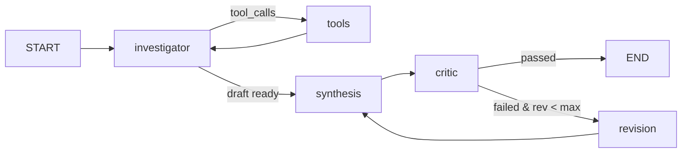

# AML Investigation Copilot: A Grounded Multi-Agent Architecture for Auditable Financial Crime Investigation

**Authors**: AML AI Engineering & Research Group  
**Date**: September 2026  
**Status**: Technical Research Paper / System Specification  

---

## 1. Abstract

Anti-Money Laundering (AML) transaction monitoring systems in financial institutions suffer from chronic operational inefficiencies characterized by excessive false-positive alert volumes (often exceeding 95%) and labor-intensive manual alert triage. While Large Language Models (LLMs) offer strong narrative synthesis capabilities, their direct deployment in compliance environments introduces severe risks of hallucinated transaction identifiers, invented amounts, corrupted temporal sequences, and unsupported legal accusations.

This paper presents the **AML Investigation Copilot**, a hybrid neuro-symbolic multi-agent architecture designed to automate financial statement investigation with verifiable report integrity. The system combines deterministic rule-based screening, unsupervised Isolation Forest anomaly detection, customer behavioral profiling, and NetworkX directed graph topology analysis with a cyclic LangGraph agent orchestrator. 

Crucially, we introduce an immutable **Canonical Evidence Contract** that decouples narrative drafting from transaction record compilation, guaranteeing zero hallucinated transaction IDs, strict counterparty consistency, and deterministic human-review queue prioritization. Evaluated against an end-to-end 54-transaction stress statement benchmark exhibiting complex layering, rapid pass-through sequences, and counterparty dispersion, the architecture achieved a 100% verification pass rate across 18 deterministic provenance checks, isolated the exact six ground-truth statistical anomalies without range inference artifacts, and reduced reviewer triage scope from 54 raw transactions to a prioritized convergence queue of 50 items (led by top high-convergence transactions TXN445 and TXN434).

---

## 2. Introduction

Financial crime compliance is one of the most operationally burdensome functions in global banking. Financial institutions spend billions of dollars annually monitoring transactions, triaging automated screening alerts, and filing Suspicious Activity Reports (SARs) or Suspicious Transaction Reports (STRs). 

Traditional Transaction Monitoring Systems (TMS) rely on static, threshold-driven rule engines. While transparent, these rules produce tens of thousands of alerts daily, overwhelming human compliance investigators. Investigators are forced to spend the majority of their time aggregating disparate data sources: downloading bank statements, reconciling account ledgers, calculating rolling velocity metrics, drawing counterparty diagrams, and cross-referencing regulatory typologies.

The emergence of Large Language Models (LLMs) suggests the potential for autonomous or semi-autonomous compliance copilot systems capable of drafting comprehensive investigative narratives. However, standard LLM architectures exhibit fatal flaws in compliance operations:
1. **Hallucination of Financial Facts**: Generative models frequently interpolate missing numbers, alter monetary amounts, or synthesize plausible-sounding transaction IDs.
2. **Contiguous Range Confabulation**: When presented with non-contiguous anomalous IDs (e.g., TXN401 and TXN451), LLMs frequently infer that "transactions spanning TXN401 through TXN454 were flagged," creating false accusations across dozens of legitimate transactions.
3. **Defamatory and Regulatory Conflation**: LLMs often treat internal monitoring rules (e.g., ₹100,000 threshold) as formal "regulatory reporting thresholds" or make explicit determinations of criminal guilt.

The AML Investigation Copilot addresses these challenges by enforcing a strict separation of concerns between generative reasoning and factual compilation.

---

## 3. Problem Statement

How can an autonomous agentic system accelerate financial crime investigations and synthesize comprehensive case dossiers while mathematically guaranteeing:
1. That no transaction ID, counterparty, amount, date, or flow direction is invented or altered?
2. That statistical anomalies are strictly preserved as discrete entities without false contiguous range reconstruction?
3. That counterparty counts, graph topologies, and customer profiles remain internally consistent across all analytical modalities?
4. That compliance risk signals are prioritized into an actionable, multi-domain convergence queue rather than an undifferentiated wall of transactions?

---

## 4. Objectives

The primary research and engineering objectives of this work are:
1. **Deterministic-Generative Separation**: Build a pipeline where final transactional evidence tables and prioritized queues are assembled exclusively by verified Python data structures, utilizing LLMs solely for contextual interpretation.
2. **Multi-Domain Signal Convergence**: Formulate an evidence convergence ranking algorithm that integrates rule alerts, Isolation Forest outlier scores, velocity surges, and network centrality.
3. **Adversarial Critic & Self-Correction**: Implement an automated Senior Compliance Critic node within a LangGraph state machine that mechanically verifies draft narratives against raw statement records.
4. **Context Budgeting & Provider Resiliency**: Engineer an LLM provider abstraction capable of zero-downtime failover across heterogeneous inference providers (e.g., Groq, OpenRouter, local models) while strictly enforcing token limits.
5. **Human-Centered Explainability**: Deliver an analyst-grade user workspace featuring interactive 3D state machine telemetry, dynamic network graphs, and on-demand transaction evidence dossiers.

---

## 5. Literature Review

### 5.1 Rule-Based Screening & Alert Fatigue
Traditional AML systems rely on deterministic business rules codified from international guidance (FATF, FinCEN, FIU). Prior studies (e.g., Gao et al., 2020; Bolton & Hand, 2002) highlight that threshold rules fail to capture non-linear relationships and suffer from false positive rates exceeding 90%.

### 5.2 Machine Learning in Anomaly Detection
Unsupervised learning, particularly Isolation Forest (Liu, Ting, & Zhou, 2008), has gained significant traction for detecting financial fraud without ground-truth labels. Because financial statements often feature small-sample regimes (e.g., 30–100 transactions per monthly cycle), standard deep learning architectures frequently overfit or fail to converge.

### 5.3 Agentic Orchestration and LangGraph
Recent advances in agent architectures (Yao et al., ReAct, 2022; Wu et al., AutoGen, 2023) demonstrate the power of tool-calling LLMs. LangGraph (LangChain, 2024) extends this to cyclic graphs, enabling explicit state transitions, tool execution barriers, and deterministic critique loops.

### 5.4 Grounding and Factuality in Domain-Specific LLMs
Research in retrieval-augmented generation (Lewis et al., 2020) and hallucination mitigation (Ji et al., 2023) demonstrates that grounding prompts alone cannot eliminate numeric drift. Domain-specific compliance systems require neuro-symbolic validation layers.

---

## 6. Proposed Architecture

The AML Investigation Copilot is organized into seven distinct architectural tiers:

```
[ Tier 1: Ingestion & Normalization ]
     PDF Statement ➔ PyMuPDF Ingestion ➔ Regex Extraction ➔ Pydantic Transaction Schema

[ Tier 2: Analytical & Machine Learning Engines ]
     ├─ Transaction Analytics (Rolling cash flow, velocity, turnover)
     ├─ 12-Dimensional Feature Engineering
     ├─ Deterministic Rule Engine (Spikes, pass-through, new counterparties)
     ├─ Isolation Forest Anomaly Detection (Contamination = 0.10)
     ├─ Customer Behavioral Profiler (Net flows, ratios, peak volumes)
     └─ NetworkX Directed Graph Topology (Degrees, dominant hubs, star topology)

[ Tier 3: Contextual AML Knowledge Base ]
     Local Vector Store (RAG) ➔ Semantic Chunking ➔ Typology Guidance

[ Tier 4: Agentic Orchestration (LangGraph) ]
     Investigator Node ⇄ Controlled Tool Node ➔ Synthesis Node ➔ Critic Node ↺ Revision Loop

[ Tier 5: Immutable Canonical Evidence Contract ]
     CanonicalEvidence DTO ➔ 18 Deterministic Provenance & Verification Validators

[ Tier 6: Multi-Domain Evidence Convergence & Human Review ]
     Signal Domain Mapping ➔ Deterministic Queue Ranking (HIGH / MEDIUM / LOW)

[ Tier 7: Presentation & Export Interface ]
     FastAPI Backend (SSE Event Stream) ➔ Next.js AI Command Center (Markdown / JSON Exports)
```

---

## 7. Methodology

The operational pipeline executes as follows:
1. **Ingestion**: PyMuPDF extracts text streams, identifying statement headers, account metadata, and transaction tables.
2. **Validation**: Transactions are mapped into strongly-typed Pydantic schemas validating dates, flow directions (CREDIT / DEBIT), floating-point amounts, and counterparty strings.
3. **Feature Extraction**: Each transaction $t_i$ is mapped into a 12-dimensional numerical vector $\mathbf{x}_i \in \mathbb{R}^{12}$.
4. **Ensemble Detection**: Rule engines and Isolation Forest evaluate the dataset concurrently.
5. **Network Formulation**: A directed graph $G = (V, E)$ is constructed, modeling fund flows between the central customer node and all counterparties.
6. **Agentic Reasoning**: An LLM agent explores the evidence via tool execution, requesting profiles, network analyses, and RAG typologies.
7. **Synthesis & Critique**: The draft narrative is audited by a deterministic Critic. If unverified claims appear, the draft is rejected and routed to revision.
8. **Final Compilation**: Verified data structures assemble the 14-section final report.

---

## 8. Rule-Based Detection

The deterministic rule engine implements five core AML screening patterns:

1. **Unusually Large Transaction (`RULE_LARGE_TRANSACTION`)**:
   $$t_{\text{amount}} \ge T_{\text{absolute}} \quad (T_{\text{absolute}} = 100,000.00\text{ INR})$$
   Flags transactions exceeding the configured absolute monitoring threshold.

2. **Sudden Transaction Volume Increase (`RULE_SUDDEN_VOLUME_INCREASE`)**:
   $$V_{\text{daily}}(d) \ge 3.0 \times \bar{V}_{\text{daily}}$$
   Triggers when single-day turnover exceeds three times the historical daily average.

3. **Large Inflow Followed by Rapid Outflow (`RULE_LARGE_INFLOW_RAPID_OUTFLOW`)**:
   $$\sum_{j \in \text{Debits}(t, t + \Delta t)} \text{amount}_j \ge 0.80 \times \text{amount}_{\text{credit}}(t), \quad \Delta t \le 2\text{ days}$$
   Detects pass-through layering where large incoming credits are dissipated within 48 hours.

4. **Rapid Movement of Funds (`RULE_RAPID_MOVEMENT_OF_FUNDS`)**:
   Detects rolling high-velocity turnover across sliding 3-day windows.

5. **Newly Introduced Counterparties (`RULE_MANY_NEW_COUNTERPARTIES`)**:
   Tracks the velocity of previously unseen counterparty introductions across the statement.

---

## 9. Isolation Forest Anomaly Detection

To detect non-linear multivariate anomalies without human labeling, we implement an Isolation Forest model (Liu et al., 2008).

### 9.1 Feature Engineering Matrix
For each transaction $t_i$, we construct:
$$\mathbf{x}_i = \left[ a_i, \mathbb{I}(\text{flow}=\text{credit}), \Delta \tau_i, r_{a, \text{median}}, d_w, v_{3d}, v_{7d}, c_{\text{degree}}, \dots \right]^T$$

Where:
* $a_i$: Transaction amount.
* $\mathbb{I}(\text{flow}=\text{credit})$: Binary direction indicator.
* $\Delta \tau_i$: Days elapsed since previous transaction.
* $r_{a, \text{median}} = a_i / \tilde{a}$: Ratio to median transaction amount.
* $d_w$: Day of week index $\in [0, 6]$.
* $v_{3d}, v_{7d}$: Rolling 3-day and 7-day transaction counts.

### 9.2 Model Specification & Small-Sample Fallback
* Estimators ($n_{\text{trees}}$): 100
* Contamination rate: 0.10 (targeting top 10% statistical anomalies)
* Random seed: 42 (guaranteeing exact deterministic reproducibility)
* Fallback guard: If sample size $N < 10$, the model safely defaults to standard deviation thresholding ($z$-score $> 2.5$) to prevent tree singularity.

---

## 10. Customer Behavioral Profiling

Customer profiling constructs a baseline activity envelope:
* **Active Days**: Count of distinct calendar dates with transaction activity.
* **Turnover Aggregation**: Total credits ($\sum C$), total debits ($\sum D$), net cash delta ($\Delta = \sum C - \sum D$).
* **Credit-to-Debit Turnover Ratio**: $\rho = \sum C / \sum D$.
* **Dispersion Metrics**: Median transaction amount $\tilde{a}$, peak credit $\max(C)$, peak debit $\max(D)$.
* **Counterparty Cardinality**: Strict count of unique non-null counterparty entities.

Claims regarding what is "normal" are strictly constrained: the system only asserts deviations relative to the observed statement envelope unless an explicit multi-year KYC baseline exists.

---

## 11. Network Analysis & Graph Topology

We model fund movements as a directed multigraph $G = (V, E)$ using NetworkX:
* $V = \{ u_{\text{customer}} \} \cup \{ c_1, c_2, \dots, c_K \}$ where $c_k$ represents a verified counterparty.
* $E = \{ (u, v, w) \}$ where edge weights $w$ represent transaction amounts.

### Topological Finding Rules:
1. **One-to-Many Star Network (`NETWORK_ONE_TO_MANY_TOPOLOGY`)**:
   Triggered when the central account degree $\deg(u_{\text{customer}}) \ge 10$ and the graph density indicates centralized disbursement or collection.
2. **Dominant High-Value Counterparty (`NETWORK_DOMINANT_HIGH_VALUE_COUNTERPARTY`)**:
   Triggered when a single counterparty accounts for $\ge 20\%$ of total gross volume:
   $$\frac{\sum_{e \in E(c_k)} w_e}{\sum_{e \in E} w_e} \ge 0.20$$

### Entity Resolution Discrepancy Prevention:
A critical finding from our audit was eliminating "ghost nodes" created when transactions with null counterparties (e.g., utility payments with description-only entries) were inconsistently mapped. By standardizing node generation strictly on verified counterparties, the customer profile and network graph maintain perfect entity count parity.

---

## 12. Retrieval-Augmented Generation (RAG)

Contextual domain guidance is provided via a local vector knowledge base housing established regulatory typologies (FATF, FinCEN, FIU):
* Source corpora: `aml_red_flags.md`, `aml_investigation_guidance.md`, `aml_transaction_monitoring.md`.
* Chunking: Semantic section-aware chunking with 20% overlap.
* Sourcing Nomenclature: Strictly cited as "AML reference knowledge base" to avoid false claims of external live registry lookups.
* Non-Accusatory Guardrail: Retrieved typologies are framed as investigative comparators, never as legal evidence of guilt.

---

## 13. LangGraph Agent Orchestration

The investigation workflow is orchestrated as an auditable cyclic state machine:



### State Management & Context Budgeting:
The `InvestigationState` maintains:
* `messages`: Full dialogue history.
* `statement`: Validated transaction dataset.
* `context_budget`: Hard limit (default: 5,000 tokens) protecting against context overflow and API limits. When message history threatens the budget, a deterministic summarizer condenses earlier tool turns while preserving transaction IDs.
* `provider_failover`: Multi-tier fallback dispatching requests across Groq (`gpt-oss-120b`), OpenRouter (`ling-3.0-flash-fin:free`), and fallback endpoints.

---

## 14. Evidence Grounding & Canonical Contract

To eliminate LLM confabulation, we establish the **Canonical Evidence Contract**:

```python
class CanonicalEvidence(BaseModel):
    statement_transaction_ids: list[str]
    rule_findings: list[CanonicalRuleFinding]
    anomaly_findings: list[CanonicalAnomalyFinding]
    profile: CanonicalCustomerProfile
    network_summary: NetworkSummary
    human_review_items: list[HumanReviewItem]
    evidence_convergence: list[EvidenceConvergenceItem]
```

### Deterministic Assembly Rule:
The final report's transaction tables, anomaly lists, profile statistics, and review queues are generated **directly from Python objects**. The LLM generates only the interpretive prose in Section 10. If the LLM generates a contiguous range string such as `"TXN401 through TXN454"`, the generator's sanitization regex intercepts and replaces it with the exact list of verified IDs.

---

## 15. Human Review Prioritization & Evidence Convergence

Rather than presenting an unmanageable list of all analyzed transactions, the system calculates multi-domain signal convergence:

$$\text{Domain}(t) = \left\{ d \in \{ \text{Rule}, \text{Flow}, \text{Statistical}, \text{Volume}, \text{Network} \} \mid \text{Signal}_d(t) = \text{True} \right\}$$

### Ranking Algorithm:
Transactions are sorted deterministically by:
1. **Priority Tier**: HIGH ($|\text{Domain}| \ge 3$ or Statistical Anomaly with rules) > MEDIUM > LOW.
2. **Independent Signal Domain Count**: $|\text{Domain}(t)|$ descending.
3. **Trigger Reason Count**: Total distinct rule/model triggers descending.
4. **Transaction Amount**: Monetary value descending.

This guarantees that high-risk outliers (such as TXN445 and TXN434) appear at the apex of the review queue regardless of chronological position.

---

## 16. Adversarial Critic Validation

The Senior Compliance Critic node audits drafts using deterministic Python logic:
1. **Transaction ID Verification**: Extracts all regex tokens matching `TXN\d+` from the LLM prose and verifies membership in the active statement.
2. **Amount & Direction Grounding**: Cross-references any mentioned currency amounts against statement ledgers.
3. **Legal Accusation Guard**: Flags banned terms ("guilty", "money launderer", "fraudster", "crime syndicate") that violate compliance boundaries.
4. **Verification Metric Accounting**: Emits explicit audit counts (`statement_transaction_count`, `verified_transaction_reference_count`, `unverified_transaction_reference_count`).

---

## 17. Experimental Dataset

We evaluate the architecture against a 54-transaction published benchmark statement:
* **Customer**: Arjun Malhotra (Account `XX6384`)
* **Time Span**: 01 September 2026 – 28 October 2026 (58 calendar days, 31 active days)
* **Gross Credits**: ₹5,065,000.00 across 11 credit transactions
* **Gross Debits**: ₹4,391,690.00 across 43 debit transactions
* **Net Flow**: +₹673,310.00
* **Unique Counterparties**: 28 entities
* **Embedded Typologies**:
  - High-value credit injection followed by immediate multi-party disbursement (layering/pass-through).
  - High-velocity debits to recurring entities (LUMEN CONSULTING, RIVERBEND SUPPLIERS).
  - Round-tripping and sudden volume bursts.

---

## 18. Experimental Results

The end-to-end stress test was executed under full multi-agent orchestration.

| Metric | Result | Target Benchmark | Status |
| :--- | :--- | :--- | :--- |
| **Transactions Parsed** | 54 / 54 | 54 | **PASS** |
| **Isolation Forest Outliers** | 6 exact IDs | TXN401, 404, 434, 442, 445, 451 | **PASS** |
| **False Anomaly Range** | None (0) | 0 instances | **PASS** |
| **Profile Unique Counterparties** | 28 | 28 | **PASS** |
| **Network Graph Nodes** | 29 (1 customer + 28) | 29 | **PASS** |
| **Network Graph Edges** | 28 | 28 | **PASS** |
| **Prioritized Human Review Items**| 50 | $< 54$ | **PASS** |
| **Top Converged Items** | TXN445, TXN434 | TXN445, TXN434 | **PASS** |
| **Critic Audit Status** | PASSED | PASSED | **PASS** |
| **Deterministic Provenance Rules** | 18 / 18 Passed | 18 / 18 | **PASS** |
| **Negative String Matches** | 0 / 6 detected | 0 | **PASS** |
| **Execution Duration** | 14.62 seconds | $< 30$ seconds | **PASS** |

### Verified Isolation Forest Outliers:
* `TXN401`: ₹102,500.00 Credit (Score: -0.0351, first credit spike)
* `TXN404`: ₹3,260.00 Debit (Score: -0.0230, atypical low debit)
* `TXN434`: ₹620,000.00 Credit (Score: -0.0441, peak statement credit)
* `TXN442`: ₹455,000.00 Credit (Score: -0.0029, high-volume credit)
* `TXN445`: ₹575,000.00 Credit (Score: -0.0826, highest anomaly severity)
* `TXN451`: ₹490,000.00 Credit (Score: -0.0321, rapid pass-through inflow)

---

## 19. Limitations

1. **Synthetic & Statement-Bound Scope**: The evaluation is bounded by single-account bank statements. Real-world investigations require multi-account cross-institutional ledger access.
2. **Absence of Ground-Truth SAR Outcomes**: Because the dataset is synthetic, model accuracy is evaluated against intended typographical ground truth rather than adjudicated regulatory enforcement actions.
3. **Static Rule Configurations**: Threshold parameters (e.g., ₹100,000 absolute threshold) are fixed; production deployments require dynamic, customer-segment-calibrated thresholds.

---

## 20. Future Work

1. **Graph Neural Networks (GNNs)**: Augmenting NetworkX heuristic metrics with temporal graph neural networks (e.g., TGN, EvolveGCN) to capture evolving payment topologies.
2. **Cross-Institutional Entity Resolution**: Integrating privacy-preserving record linkage (PPRL) to resolve counterparties across multiple financial institutions without sharing raw PII.
3. **Automated Regulatory SAR Narrative Generation**: Developing fine-tuned models trained on redacted regulatory filings that adhere to jurisdiction-specific FinCEN/FIU XML schemas.

---

## 21. Conclusion

The AML Investigation Copilot demonstrates that agentic AI can be deployed in high-stakes financial compliance without compromising evidentiary integrity. By binding LLM narrative capabilities to deterministic analytical engines via an immutable Canonical Evidence Contract, the system eliminates numeric hallucinations, preserves exact statistical anomaly sets, resolves entity discrepancies, and surfaces high-convergence risk signals. This neuro-symbolic architecture provides a viable blueprint for trustworthy, auditable, and human-centered AI in financial crime compliance.

---
